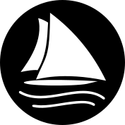

Copyright &copy; 2024 Staysail Systems, Inc.\
San Marcos, California, United States of America

> If you find this book or NNG useful, please consider sponsoring
> the project.

> [!TIP]
> This book is a work in progress, adapted from earlier sources
> and updated for the current version of NNG.

> [!NOTE]
>
> > This document is supplied under the terms of the MIT License, a
> > copy of which should be located in the distribution where this
> > file was obtained (LICENSE.txt), and reproduced below.
>
> > Third party contributions to this document were made under the
> > same license terms, and may be covered under one of the following
> > copyrights:
> >
> > - Copyright 2018 Capitar IT Group BV.
> > - Copyright 2019 Devolutions.
> > - Copyright 2020 Dirac Research.

## The MIT License

Permission is hereby granted, free of charge, to any person obtaining a copy
of this software and associated documentation files (the "Software"),
to deal in the Software without restriction, including without limitation
the rights to use, copy, modify, merge, publish, distribute, sublicense,
and/or sell copies of the Software, and to permit persons to whom
the Software is furnished to do so, subject to the following conditions:

The above copyright notice and this permission notice shall be included
in all copies or substantial portions of the Software.

THE SOFTWARE IS PROVIDED "AS IS", WITHOUT WARRANTY OF ANY KIND, EXPRESS OR
IMPLIED, INCLUDING BUT NOT LIMITED TO THE WARRANTIES OF MERCHANTABILITY,
FITNESS FOR A PARTICULAR PURPOSE AND NONINFRINGEMENT. IN NO EVENT SHALL
THE AUTHORS OR COPYRIGHT HOLDERS BE LIABLE FOR ANY CLAIM, DAMAGES OR OTHER
LIABILITY, WHETHER IN AN ACTION OF CONTRACT, TORT OR OTHERWISE, ARISING
FROM, OUT OF OR IN CONNECTION WITH THE SOFTWARE OR THE USE OR OTHER DEALINGS
IN THE SOFTWARE.
